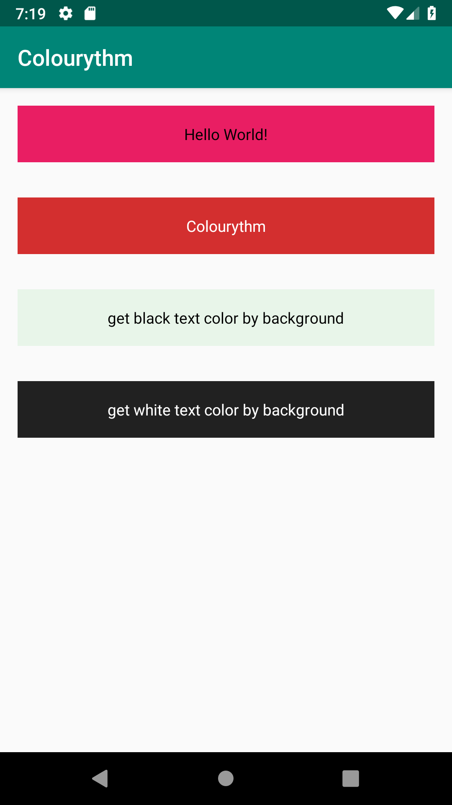

# Colourythm
[](https://jitpack.io/#mikkipastel/Colourythm)

This is library for set text color depend with background and output is black or white text color



## Installation
Add this in `build.gradle` of project

```gradle
allprojects {
  repositories {
    ...
    maven { url 'https://jitpack.io' }
  }
}
```
and add this in `build.gradle` of module

```gradle
dependencies {
  implementation 'com.github.mikkipastel:Colourythm:1.0.0-beta'
}
```

## Feature
This library calculate with [WCAG20 standard](https://www.w3.org/TR/WCAG20-TECHS/G18.html) which same [Material Design Color Tool](https://material.io/tools/color/#!/?view.left=0&view.right=0). Concept for calculation is calculate luminance from background color and compare with black and white color for contrast ratio of at least 4.5:1 with normal text.

Then this library feature is genarate text color with backgroud color and result is white or black

## Usage
You can get white/black from background for dynamic use in other module and application by put your background color at parameter to generate in function genTextBWcolorFromBG()

- put rgb color : `Colourythm().genTextBWcolorFromBg(r: Int, g: Int, b: Int)`

```kotlin
textSample.setTextColor(Colourythm().genTextBWcolorFromBg(233, 30, 99))
```

- put hex color : `Colourythm().genTextBWcolorFromBg(rgb: Int)`

```kotlin
textSample.setTextColor(Colourythm().genTextBWcolorFromBg(0xd32f2f))
```

- put resource color: `Colourythm().genTextBWcolorFromBg(context: Context, resource: Int)`

```kotlin
val color = R.color.colorBrown50
textSample.setTextColor(Colourythm().genTextBWcolorFromBg(this, color))
```

or `Colourythm().genTextBWcolorFromBg(rgb: Int)`

```kotlin
val color = ContextCompat.getColor(this, R.color.colorGrey900)
textSample.setTextColor(Colourythm().genTextBWcolorFromBg(color))
```

### Another Feature
and can use another feature for
- get luminance from red, green, blue : `Colourythm().luminance(r: Int, g: Int, b: Int)`
- get rgb from hex : `ConvertColoury().getGreyScaleFromRGB(r: Int, g: Int, b: Int)`
- get gray scale from rgb : `ConvertColoury().getRGBFromHEX(rgb: Int)`

## License
Copyright (c) 2019 MikkiPastel

Permission is hereby granted, free of charge, to any person obtaining a copy
of this software and associated documentation files (the "Software"), to deal
in the Software without restriction, including without limitation the rights
to use, copy, modify, merge, publish, distribute, sublicense, and/or sell
copies of the Software, and to permit persons to whom the Software is
furnished to do so, subject to the following conditions:

The above copyright notice and this permission notice shall be included in all
copies or substantial portions of the Software.

THE SOFTWARE IS PROVIDED "AS IS", WITHOUT WARRANTY OF ANY KIND, EXPRESS OR
IMPLIED, INCLUDING BUT NOT LIMITED TO THE WARRANTIES OF MERCHANTABILITY,
FITNESS FOR A PARTICULAR PURPOSE AND NONINFRINGEMENT. IN NO EVENT SHALL THE
AUTHORS OR COPYRIGHT HOLDERS BE LIABLE FOR ANY CLAIM, DAMAGES OR OTHER
LIABILITY, WHETHER IN AN ACTION OF CONTRACT, TORT OR OTHERWISE, ARISING FROM,
OUT OF OR IN CONNECTION WITH THE SOFTWARE OR THE USE OR OTHER DEALINGS IN THE
SOFTWARE.
